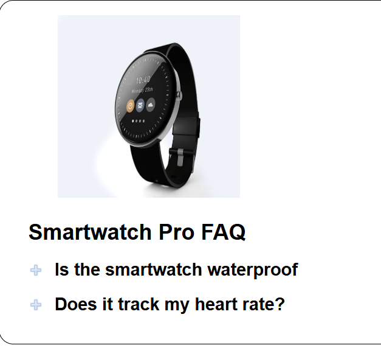
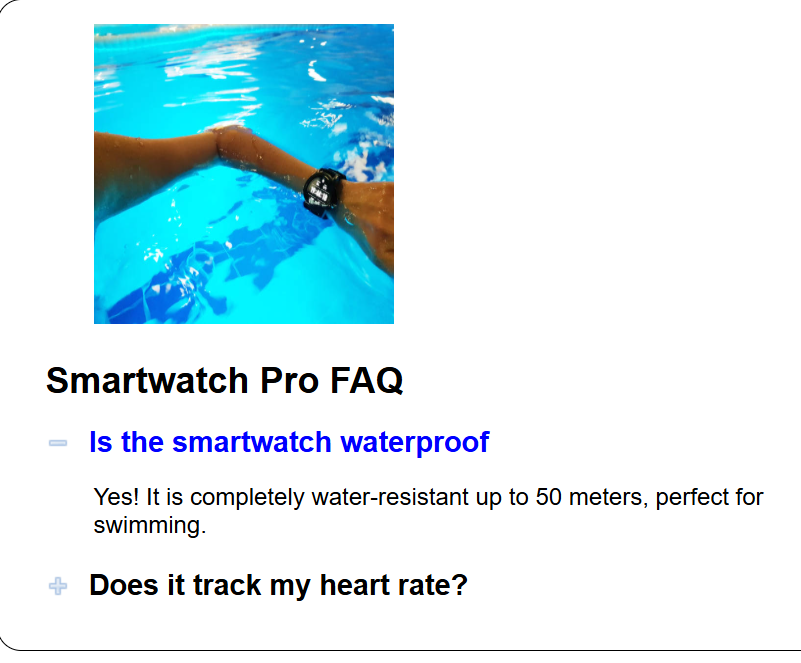
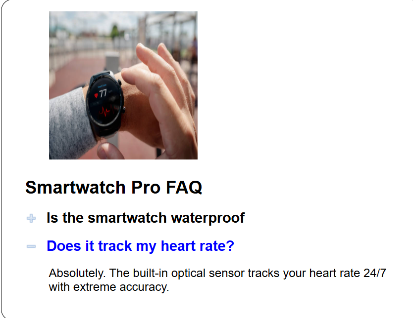

# 🧮 FAQ of a smart watch CH 6
### 👤 Authors
- Ethan McEvoy (https://github.com/EMcE01)
- Brayden Hermanson (https://github.com/brherm05)

---

## 📚 Table of Contents
- [📖 Project Overview](#-project-overview--summary)
- [🧰 Tech Stack](#-tech-stack)
- [🛠 Development Tools](#-development-tools)
- [💡 Core Concepts](#-core-concept--new-concepts)
- [✨ Features](#-features)
- [🖼 Visual Aids](#-visual-aids-screenshots--gifs--reports--data-input--output)
- [🧠 Reflection](#-reflection-what-i-learned)

---

## 📖 Project Overview / Summary
> 🔝 [Back to TOC](#-table-of-contents)

This program is a simple static website that displays frequently asked questions. As the user clicks on a question, the plus symbol swaps to a minus, the picture changes, and a text box appears with the answer. The user can then click on the question already expanded to return to the starter image.

---

## 🧰 Tech Stack
> 🔝 [Back to TOC](#-table-of-contents)

| Category       | Technology Used |
|----------------|----------------|
| Frontend       | HTML, CSS|
| Backend        | JavaScript|

---

## 🛠 Development Tools
> 🔝 [Back to TOC](#-table-of-contents)

| Tool | Purpose |
|------|--------|
| WebStorm | Primary Code editor |
| VS Code | Code editor |
| GitHub | Version control |
| Chrome DevTools | Debugging |

---

## 💡 Core Concept / New Concepts
> 🔝 [Back to TOC](#-table-of-contents)

Highlight key concepts learned or applied:

- 📌 Image swapping – Swapping between images based on user behavior 
- 📌 Text reveal/hide – Revealing and removing text based on user behavior
- 📌 text colors – changing the color of the question when clicked
  
---

## ✨ Features
> 🔝 [Back to TOC](#-table-of-contents)

- ✅ Image swapping – Swapping between images based on user behavior 
- ✅ Text reveal/hide – Revealing and removing text based on user behavior
- ✅ text colors – changing the color of the question when clicked 

---

## 🖼 Visual Aids: Screenshots / GIFs / Reports / Data Input & Output
> 🔝 [Back to TOC](#-table-of-contents)

## ScreenShots
## starting screen

## Question 1

## Question 2

---

## 🧠 Reflection: What I Learned
> 🔝 [Back to TOC](#-table-of-contents)

This project was one that I found hard to keep my attention as the final product wasn't as fun to play with once it was complete. I didn't know it at the time of coding, but my partner informed me after the fact he felt that I took over the project. Looking forward I will be sure to slow myself down and make sure any groupmates don't feel exlcuded from the process.
